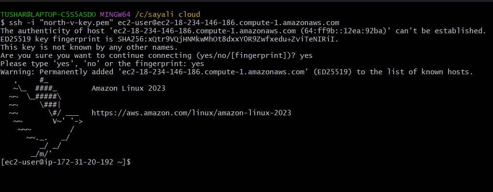
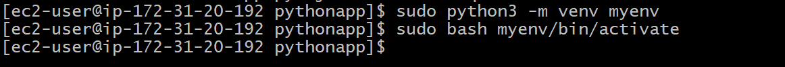
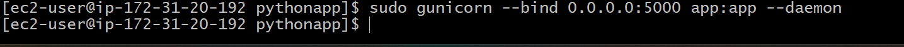

# Deploy and Serve Your Python App with Nginx

## Introduction

This project offers a complete walkthrough for deploying a Python application in a production-ready environment using a proxy server. It covers everything from preparing both the development and server environments, installing essential packages, configuring the application, and setting up a proxy server like Nginx to handle and route incoming traffic effectively. Following this guide will help enhance the application's performance, scalability, and overall security.

## Prerequisites

Before you deploy this Python application, make sure the following tools and services are properly installed and set up:

1. Python 3.x – The app is built using Python version 3 or later.

2. Pip – Required to install and manage Python packages.

3. Git (optional) – Useful for cloning the project repository from a version control system.

4. Virtual Environment (venv) – Recommended to keep project dependencies isolated and manageable.

5. Proxy Server – Either Nginx or Apache is needed to route and manage incoming traffic to the application.

## Deployment Steps

### Step 1: Launch EC2 instance and Establishing a secure connection to your EC2 instance

  1. Launch instance

  2. Copy ssh command

  3. Paste ssh command in Git bash terminal 

### Step 2: Upgrade System Packages and Set Up Python

    1. update 
    #sudo yum update 

    2. install python 
    #sudo yum install python3 -y 

    3. install pip 
    #sudo yum install python3-pip

### Step 3: Upload/Clone Your Application

         Install a git

         #sudo yum install git -y

2. Clone the Application and change into the pythonapp folder.

       clone git application 
       #git clone <git url> 

       Go inside the projrct folder
       #cd pythonapp 

### Step 4: Set up a virtual environment and activate it.

        create virtual environment 
        #sudo python3 -m venv myenv 

        activate file 
        #sudo source myenv/bin/activate

### Step 5: Install Dependencies.

         sudo pip install -r requirement.txt

### Step 6: Run the application in the background.

    sudo gunicorn --bind 0.0.0.0:5000 <file_name>:app -- daemon 

    

### Step 7: Build the Proxy Server

1. Setting up Nginx as a Proxy Server

       sudo yum install nginx 

2. Start, enable and check status of nginx
         
        sudo systemctl start nginx 
        sudo systemctl enable nginx 
        sudo systemctl status nginx  

3. Set up a server block for your application

      1. open nginx.conf

       sudo vim nginx.conf 

      2. Edit and add server block as show below 

### Step 8: Deployment Testing

   1. Copy Public IP

   2. Final Output

## Summary

This project is a step-by-step guide to help you deploy a Python app using a proxy server. It shows you how to set up your environment, install what you need, configure the app, and use a proxy server like Nginx to handle requests smoothly.

